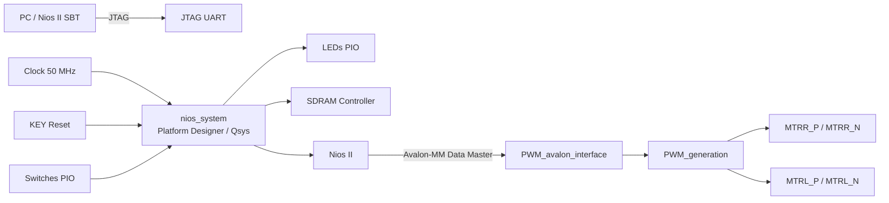
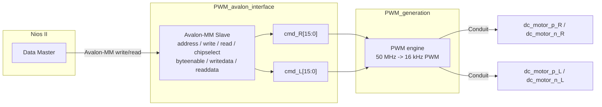

# Projet SoC Nios II / Avalon-MM pour Pilotage PWM de Moteurs DC

## 1. Objectif

Ce projet implémente un SoC sur FPGA Cyclone IV E permettant de piloter deux moteurs DC d'une plateforme type CuteCar au moyen :

- d'un processeur **Nios II**,
- d'un **bus Avalon Memory-Mapped (Avalon-MM)**,
- d'un **IP Core PWM personnalise**,
- d'une **SDRAM externe**,
- d'E/S simples pour les **LEDs** et les **switches**,
- d'un **JTAG UART** pour le debug et les echanges avec l'hote.

L'objectif principal est d'encapsuler un generateur PWM materiel dans un composant Qsys/Platform Designer accessible en memoire par le Nios II.

## 2. Vue d'Ensemble de l'Architecture



## 3. Composants Cles

### 3.1 `lights.vhd`

`lights.vhd` est le top-level du projet. Il relie :

- l'horloge `CLOCK_50`,
- le reset via `KEY(0)`,
- les peripheriques de carte (`SW`, `LED`),
- la SDRAM,
- les sorties moteur,
- le signal `MTR_Sleep_n` maintenu a `'1'` pour activer le driver.

### 3.2 `nios_system.qsys`

Le systeme Qsys instancie :

- un **Nios II Tiny**,
- une **memoire on-chip**,
- un **controleur SDRAM**,
- un **JTAG UART**,
- deux **PIO** (`LEDs`, `switches`),
- l'IP personnalise **`PWM_avalon_interface`**.

### 3.3 `PWM_avalon_interface.vhd`

Ce bloc est l'interface entre le Nios II et le generateur PWM. Il expose un esclave **Avalon-MM** a deux registres 16 bits :

- un registre de commande moteur droit,
- un registre de commande moteur gauche.

Il memorise les commandes ecrites par le Nios II puis les transmet au bloc `PWM_generation`.

Concretement, cette interface PWM realise trois fonctions :

- elle adapte un bloc purement materiel a une vue "registre memoire" exploitable par le Nios II ;
- elle separe la commande moteur droit et la commande moteur gauche via `address(0)` ;
- elle fournit une interface proprement integrable dans Qsys, avec clock, reset, esclave Avalon-MM et sorties exportees.

### 3.4 `PWM_generation.vhd`

Ce bloc realise la generation PWM materielle a partir de deux mots de commande 16 bits. Il produit quatre sorties :

- `dc_motor_p_R`
- `dc_motor_n_R`
- `dc_motor_p_L`
- `dc_motor_n_L`

Chaque mot de commande contient :

- `bit 13` : **GO** (`1` = activation, `0` = arret),
- `bit 12` : **DIR** (`0` / `1` selon le sens),
- `bits 11:0` : **duty cycle** PWM.

## 4. Schema du Composant Personnalise



## 5. Types de Communication Utilises

### 5.1 Communication Nios II <-> IP personnalise : Avalon-MM

Le Nios II dialogue avec l'IP PWM au travers du **bus Avalon Memory-Mapped**. Ce mode de communication est adapte a un peripherique de controle simple exposant des registres internes.

#### Role de l'interface Avalon-MM

- le Nios II effectue des **ecritures memoire** pour configurer les moteurs ;
- l'IP capture `writedata` lorsque `chipselect='1'` et `write='1'` ;
- le bit `address` selectionne le registre moteur droit ou gauche ;
- `byteenable` autorise des ecritures partielles par octet ;
- `readdata` renvoie le contenu courant des registres, utile pour lecture/diagnostic.

#### Signaux Avalon-MM implementes

| Signal | Direction | Role |
|---|---|---|
| `address(0)` | Entree IP | Selection du registre droit/gauche |
| `write` | Entree IP | Validation d'une ecriture |
| `read` | Entree IP | Validation d'une lecture |
| `chipselect` | Entree IP | Selection du peripherique |
| `byteenable(1:0)` | Entree IP | Ecriture partielle 16 bits |
| `writedata(15:0)` | Entree IP | Mot de commande envoye par le CPU |
| `readdata(15:0)` | Sortie IP | Retour du registre selectionne |

#### Pourquoi Avalon-MM est pertinent ici

- interface native de Qsys/Platform Designer ;
- integration immediate au Nios II ;
- modele simple de peripherique a registres ;
- pas de protocole complexe ni de logique de flux a maintenir ;
- adapte a des commandes de controle deterministes et peu volumineuses.

### 5.2 Alternative possible : deux conduits de commande

Le projet aurait aussi pu etre realise sans interface Avalon-MM complete, en exposant simplement **deux conduits de commande** :

- un conduit 16 bits pour la commande moteur droit ;
- un conduit 16 bits pour la commande moteur gauche.

Cette approche aurait ete faisable si l'objectif avait uniquement ete de relier une logique materielle a un autre bloc HDL. En revanche, pour un pilotage par **Nios II**, elle est moins adaptee :

- un conduit n'est pas un peripherique memoire adresse ;
- il n'offre pas directement le modele lecture/ecriture standard attendu par le logiciel embarque ;
- il faut ajouter davantage de logique d'adaptation autour du processeur ou utiliser d'autres mecanismes de passage de commandes ;
- l'integration dans Qsys est moins propre qu'un esclave Avalon-MM lorsqu'on veut faire du controle logiciel.

Le choix d'une interface PWM en **Avalon-MM** est donc plus professionnel dans ce contexte : le composant devient un vrai peripherique du SoC, adresse en memoire, documentable, testable et reutilisable.

### 5.3 Communication IP <-> exterieur : interface `conduit`

Les sorties moteur ne transitent pas sur Avalon-ST ni via un second bus memoire. Elles sont exportees par Qsys sous forme de **conduits** vers le top-level FPGA.

Les quatre lignes exportees sont :

- `dc_motor_p_r`
- `dc_motor_n_r`
- `dc_motor_p_l`
- `dc_motor_n_l`

Dans `lights.vhd`, elles sont raccordees directement aux broches moteur :

- `MTRR_P`
- `MTRR_N`
- `MTRL_P`
- `MTRL_N`

### 5.4 Interfaces d'infrastructure

Outre Avalon-MM, l'IP expose egalement :

- une interface **clock** : `clock_sink`,
- une interface **reset** : `reset_sink`.

Elles assurent la synchronisation du composant avec le reste du systeme Qsys.

## 6. Mappage Memoire du Systeme

Le systeme expose les peripheriques suivants sur l'espace memoire du Nios II :

| Peripherique | Base address | Taille logique | Type |
|---|---:|---:|---|
| `PWM_avalon_interface_0` | `0x0020` | `4` octets | Avalon-MM |
| `onchip_memory` | `0x1000` | `4 KB` | Memoire |
| `nios2_qsys_0.jtag_debug_module` | `0x2800` | `2 KB` | Debug |
| `LEDs` | `0x3000` | `16` octets | PIO |
| `switches` | `0x3010` | `16` octets | PIO |
| `jtag_uart` | `0x3020` | `8` octets | UART JTAG |
| `sdram` | `0x04000000` | plage externe | SDRAM |

### Registres de l'IP PWM

| Adresse | Registre | Description |
|---|---|---|
| `0x0020` | `cmd_R` | Commande moteur droit |
| `0x0022` | `cmd_L` | Commande moteur gauche |

## 7. Format du Mot de Commande PWM

Chaque moteur est pilote par un mot 16 bits :

| Bits | Nom | Description |
|---|---|---|
| `15:14` | Reserves | Non utilises |
| `13` | `GO` | `1` = moteur actif, `0` = arret |
| `12` | `DIR` | Sens de rotation |
| `11:0` | `DUTY` | Largeur d'impulsion PWM |

### Exemple

```text
0x2000 | duty
```

- `0x2000` met `GO=1` et `DIR=0`
- `duty` doit rester dans l'intervalle `0 .. 3125` environ

Le bloc PWM fonctionne a partir d'une horloge FPGA de **50 MHz** et d'une frequence PWM cible de **16 kHz**.

```text
periode_pwm = 50 000 000 / 16 000 = 3125 tops
```

## 8. Exemple de Communication Logicielle C avec l'IP

Exemple recommande pour piloter les deux registres du composant :

```c
#include <stdint.h>

#define PWM_BASE   0x0020u
#define MOTOR_R    (*(volatile uint16_t *)(PWM_BASE + 0x0))
#define MOTOR_L    (*(volatile uint16_t *)(PWM_BASE + 0x2))

static inline uint16_t pwm_cmd(uint8_t go, uint8_t dir, uint16_t duty)
{
    return ((go & 0x1u) << 13) | ((dir & 0x1u) << 12) | (duty & 0x0FFFu);
}

void moteurs_avant(uint16_t duty)
{
    MOTOR_R = pwm_cmd(1, 0, duty);
    MOTOR_L = pwm_cmd(1, 0, duty);
}

void moteurs_stop(void)
{
    MOTOR_R = 0x0000;
    MOTOR_L = 0x0000;
}
```

## 9. Flux de Fonctionnement

1. Le Nios II execute le code logiciel depuis le systeme memoire.
2. Le logiciel ecrit des mots de commande dans l'IP PWM via Avalon-MM.
3. `PWM_avalon_interface` stocke les commandes dans ses registres internes.
4. `PWM_generation` interprete `GO`, `DIR` et `DUTY`.
5. Les sorties PWM sont exportees hors du sous-systeme Qsys par conduits.
6. Le top-level `lights.vhd` relie ces sorties aux broches du driver moteur.

## 10. Travail Realise et Resultat Obtenu

Le travail mene dans ce projet a consiste a :

- partir d'un generateur PWM HDL existant ;
- concevoir une interface `PWM_avalon_interface` compatible Avalon-MM ;
- encapsuler l'ensemble sous forme d'IP personnalisable dans Qsys ;
- integrer cet IP au SoC Nios II avec SDRAM, PIO et JTAG UART ;
- piloter ensuite les moteurs depuis le logiciel C par ecritures memoire.

Le resultat obtenu est un composant PWM exploitable comme un vrai peripherique du systeme. Le Nios II peut envoyer des consignes de vitesse et de direction en ecrivant dans deux registres simples, tandis que la generation du signal PWM reste geree en materiel, a frequence stable, sans charge de calcul sur le processeur.

## 11. Structure du Depot

```text
.
|-- app_software/               Logiciels Nios II de test
|-- doc/                        Documentation pedagogique et de reference
|-- IPCORE/                     IP modules HDL utilises dans le projet
|-- nios_system/                Fichiers generes par Qsys/synthese
|-- lights.vhd                  Top-level FPGA
|-- nios_system.qsys            Description du systeme Platform Designer
|-- PWM_avalon_interface_hw.tcl Declaration Qsys du composant personnalise
|-- lights.qsf                  Contraintes et brochage Quartus
```

## 12. Points d'Attention d'Integration

- le composant PWM n'utilise pas d'interruptions ;
- la commande des moteurs se fait exclusivement par acces memoire Avalon-MM ;
- les sorties moteurs sont des **conduits materiels**, pas des peripheriques memoire ;
- le projet est concu pour un deploiement Quartus/Qsys avec chargement logiciel Nios II via JTAG.

## 13. References du Projet

- `IPCORE/PWM_generation.vhd`
- `IPCORE/pwm_avalon_interface.vhd`
- `PWM_avalon_interface_hw.tcl`
- `nios_system.qsys`
- `lights.vhd`
- `doc/Making_Qsys_Components (1).pdf`
